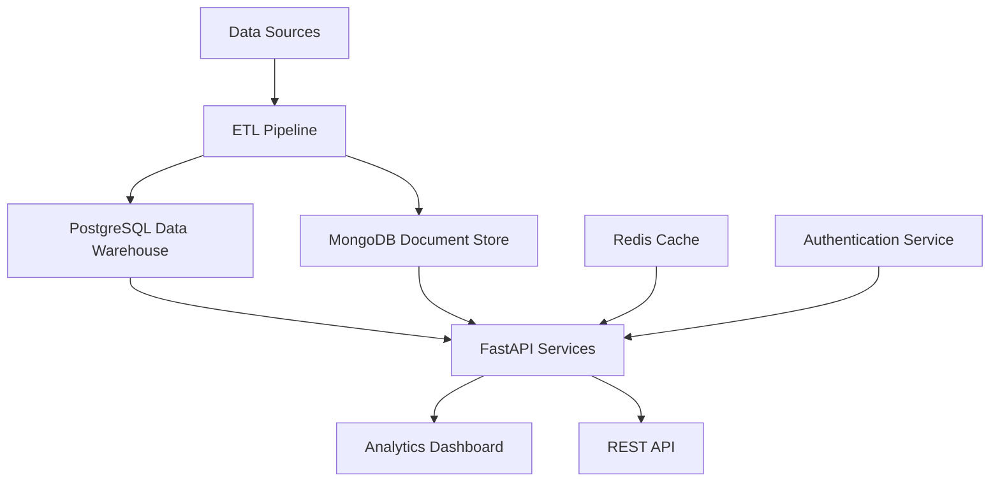

# 🎓 Education Analytics Data Warehouse

[](https://python.org)
[](https://fastapi.tiangolo.com)
[](https://postgresql.org)
[](https://mongodb.com)
[](https://docker.com)
[](LICENSE)

A comprehensive data warehouse solution for educational institutions built with modern Python technologies. This project provides real-time analytics, ETL pipelines, and interactive dashboards to help educational institutions make data-driven decisions.

## ✨ Features

- 🏗️ **Modern Architecture**: Microservices-based design with FastAPI
- 📊 **Real-time Analytics**: Interactive dashboards with Plotly
- 🔄 **ETL Pipelines**: Automated data processing and integration
- 🗄️ **Dual Database**: PostgreSQL for structured data, MongoDB for semi-structured data
- 📈 **Predictive Analytics**: Student success prediction and risk identification
- 🔒 **Security**: JWT authentication and role-based access control
- 🐳 **Docker Ready**: Complete containerization with Docker Compose
- 📱 **RESTful API**: Comprehensive API with automatic documentation

## 🏗️ Architecture Overview



## 📁 Project Structure

```
education_analytics/
├── 📁 app/
│   ├── 📁 api/                 # FastAPI routes and endpoints
│   │   └── 📁 api_v1/
│   │       ├── 📄 api.py
│   │       └── 📁 endpoints/
│   │           ├── 📄 analytics.py
│   │           ├── 📄 courses.py
│   │           ├── 📄 etl.py
│   │           ├── 📄 feedback.py
│   │           └── 📄 students.py
│   ├── 📁 core/               # Core configuration and utilities
│   │   └── 📄 config.py
│   ├── 📁 db/                 # Database models and connections
│   │   ├── 📄 database.py
│   │   ├── 📄 models.py
│   │   ├── 📄 mongodb_models.py
│   │   └── 📄 optimization.py
│   ├── 📁 dashboards/         # Plotly dashboard components
│   │   └── 📄 dashboard.py
│   ├── 📁 models/             # Pydantic models
│   │   └── 📄 schemas.py
│   ├── 📁 services/           # Business logic services
│   │   ├── 📄 analytics_service.py
│   │   ├── 📄 course_service.py
│   │   ├── 📄 etl_service.py
│   │   ├── 📄 feedback_service.py
│   │   └── 📄 student_service.py
│   └── 📄 main.py
├── 📁 data/                   # Sample data and uploads
├── 📁 docs/                   # Documentation
├── 📁 migrations/             # Database migration files
├── 📁 scripts/                # Utility scripts
├── 📄 docker-compose.yml      # Docker services configuration
├── 📄 Dockerfile             # Docker configuration
├── 📄 requirements.txt        # Python dependencies
└── 📄 README.md              # This file
```

## 🚀 Quick Start

### Prerequisites

- Python 3.9+
- PostgreSQL 13+
- MongoDB 5.0+
- Docker & Docker Compose (recommended)

### Option 1: Docker Setup (Recommended)

1. **Clone the repository:**
   ```bash
   git clone https://github.com/gyanendra-hash/education-analytics.git
   cd education_analytics
   ```

2. **Start all services:**
   ```bash
   docker-compose up -d
   ```

3. **Access the application:**
   - 🌐 **API Documentation**: http://localhost:8000/docs
   - 📊 **Dashboard**: http://localhost:8000/dashboard
   - 🔍 **Health Check**: http://localhost:8000/health

### Option 2: Local Development Setup

1. **Clone and setup:**
   ```bash
   git clone https://github.com/gyanendra-hash/education-analytics.git
   cd education_analytics
   python -m venv venv
   source venv/bin/activate  # On Windows: venv\Scripts\activate
   pip install -r requirements.txt
   ```

2. **Configure environment:**
   ```bash
   cp env.example .env
   # Edit .env with your database credentials
   ```

3. **Start databases:**
   ```bash
   docker-compose up -d postgres mongodb redis
   ```

4. **Run migrations:**
   ```bash
   alembic upgrade head
   ```

5. **Start the application:**
   ```bash
   uvicorn app.main:app --reload --host 0.0.0.0 --port 8000
   ```

## 🗄️ Database Schema

### PostgreSQL Data Warehouse

**Fact Tables:**
- `student_performance_fact` - Student grades and performance metrics
- `enrollment_fact` - Course enrollment data
- `attendance_fact` - Student attendance records

**Dimension Tables:**
- `dim_student` - Student demographics and information
- `dim_course` - Course details and metadata
- `dim_time` - Time dimension for temporal analysis
- `dim_instructor` - Instructor information
- `dim_department` - Department and program details

### MongoDB Collections

- `student_feedback` - Unstructured student feedback and comments
- `system_logs` - Application and system logs
- `survey_responses` - Student survey data
- `performance_metrics` - Real-time performance indicators

## 🔄 ETL Pipeline

The ETL pipeline processes data from multiple sources:

1. **Extract** 📥 - CSV, Excel, JSON files from various systems
2. **Transform** 🔄 - Data cleaning, validation, and dimensional modeling
3. **Load** 📤 - Insert into appropriate PostgreSQL tables and MongoDB collections

### Supported Data Formats

- 📊 Student records (CSV/Excel)
- 📈 Grade data (JSON/CSV)
- 📚 Course catalogs (Excel)
- 📝 Survey responses (JSON)
- 📋 Log files (TXT/JSON)

## 📊 Analytics Features

### Real-time Dashboards

1. **Student Performance Dashboard**
   - Grade distribution analysis
   - Performance trends over time
   - Subject-wise performance comparison

2. **Institutional KPI Dashboard**
   - Enrollment statistics
   - Retention rates
   - Faculty performance metrics

3. **Predictive Analytics**
   - Student success prediction
   - Risk identification
   - Resource optimization recommendations

## 🔧 API Endpoints

### Student Management
- `GET /api/v1/students` - List all students
- `GET /api/v1/students/{id}` - Get student details
- `POST /api/v1/students` - Create new student
- `PUT /api/v1/students/{id}` - Update student
- `DELETE /api/v1/students/{id}` - Delete student

### Analytics
- `GET /api/v1/analytics/performance` - Student performance metrics
- `GET /api/v1/analytics/enrollment` - Enrollment statistics
- `GET /api/v1/analytics/kpis` - Institutional KPIs
- `GET /api/v1/analytics/trends` - Performance trends

### ETL Operations
- `POST /api/v1/etl/upload` - Upload data files
- `POST /api/v1/etl/process` - Process uploaded data
- `GET /api/v1/etl/status/{job_id}` - Check ETL job status
- `GET /api/v1/etl/jobs` - List all ETL jobs

### Course Management
- `GET /api/v1/courses` - List all courses
- `POST /api/v1/courses` - Create new course
- `GET /api/v1/courses/{id}/students` - Get course students

### Feedback System
- `GET /api/v1/feedback` - List feedback
- `POST /api/v1/feedback` - Submit feedback
- `GET /api/v1/feedback/analytics` - Feedback analytics

## 🧪 Testing

Run the comprehensive test suite:

```bash
# Run all tests
pytest tests/ -v

# Run with coverage
pytest tests/ --cov=app --cov-report=html

# Run specific test categories
pytest tests/unit/ -v
pytest tests/integration/ -v
```

## 📈 Performance Optimization

- **Database Indexing** 🗂️ - Optimized indexes on frequently queried columns
- **Query Optimization** ⚡ - Efficient SQL queries with proper joins
- **Caching** 💾 - Redis caching for frequently accessed data
- **Connection Pooling** 🔗 - Database connection optimization
- **Async Processing** 🚀 - Asynchronous operations for better performance

## 🔒 Security Features

- 🔐 **JWT Authentication** - Secure token-based authentication
- 👥 **Role-based Access Control** - Granular permission system
- 🛡️ **Data Encryption** - Encryption at rest and in transit
- 🚦 **API Rate Limiting** - Protection against abuse
- ✅ **Input Validation** - Comprehensive data validation and sanitization
- 🔍 **Audit Logging** - Complete audit trail for all operations

## 🛠️ Development

### Code Quality

```bash
# Format code
black app/ tests/

# Sort imports
isort app/ tests/

# Lint code
flake8 app/ tests/

# Type checking
mypy app/
```

### Database Migrations

```bash
# Create new migration
alembic revision --autogenerate -m "Description of changes"

# Apply migrations
alembic upgrade head

# Rollback migration
alembic downgrade -1
```

## 📚 Documentation

- 📖 [API Documentation](http://localhost:8000/docs) - Interactive API docs
- 🏗️ [Architecture Guide](docs/ARCHITECTURE.md) - System architecture details
- 🚀 [Deployment Guide](docs/DEPLOYMENT_GUIDE.md) - Production deployment
- 🔧 [Development Guide](docs/DEVELOPMENT.md) - Development setup and guidelines

## 🤝 Contributing

We welcome contributions! Please follow these steps:

1. 🍴 Fork the repository
2. 🌿 Create a feature branch (`git checkout -b feature/amazing-feature`)
3. 💾 Commit your changes (`git commit -m 'Add amazing feature'`)
4. 📤 Push to the branch (`git push origin feature/amazing-feature`)
5. 🔄 Open a Pull Request

### Contribution Guidelines

- Follow PEP 8 style guidelines
- Add tests for new functionality
- Update documentation as needed
- Ensure all tests pass
- Write clear commit messages

## 📊 Project Status

- ✅ Core API functionality
- ✅ Database models and migrations
- ✅ ETL pipeline implementation
- ✅ Basic dashboard functionality
- ✅ Authentication and security
- 🚧 Advanced analytics features
- 🚧 Machine learning integration
- 🚧 Mobile app integration

## 🐛 Bug Reports & Feature Requests

Found a bug or have a feature request? Please open an issue on GitHub:

- 🐛 [Report a Bug](https://github.com/gyanendra-hash/education-analytics/issues/new?template=bug_report.md)
- 💡 [Request a Feature](https://github.com/gyanendra-hash/education-analytics/issues/new?template=feature_request.md)

## 📄 License

This project is licensed under the MIT License - see the [LICENSE](LICENSE) file for details.

## 👥 Team

- **Lead Developer** - [Your Name](https://github.com/yourusername)
- **Data Engineer** - [Team Member](https://github.com/teammember)
- **UI/UX Designer** - [Designer](https://github.com/designer)

## 🙏 Acknowledgments

- FastAPI team for the excellent framework
- PostgreSQL and MongoDB communities
- Plotly for amazing visualization tools
- All contributors and users

## 📞 Support

- 📧 Email: support@educationanalytics.com
- 💬 Discord: [Join our community](https://discord.gg/educationanalytics)
- 📖 Documentation: [docs.educationanalytics.com](https://docs.educationanalytics.com)

---

<div align="center">

**⭐ Star this repository if you found it helpful!**

Made with ❤️ by the Education Analytics Team

</div>